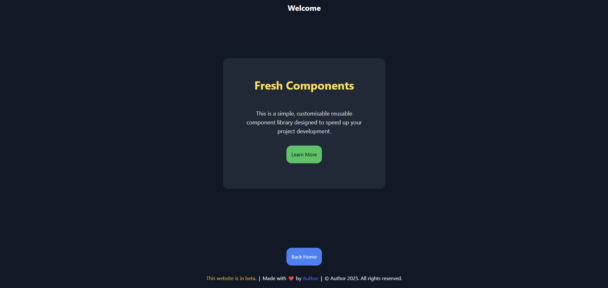
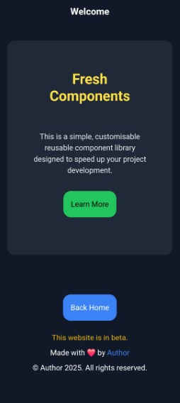

# fresh-components

> [!IMPORTANT]
> This package is not currently published to JSR due to limitations in .tsx support. It will be published as soon as possible.

A collection of reusable UI components built with [Preact](https://preactjs.com/) and configured to work well with Deno Fresh. These components include customisable layout structures, typographic elements, and buttons that can be tailored via props. All components are designed to work with any form factor and can be easily integrated into your project.

---

## Usage

> [!NOTE]
> All components are styled using Tailwind CSS classes. Any colour or size customisations should be done using Tailwind classes or by modifying the component styles directly.

```tsx
import { Layout, Text, Button } from "jsr:@spongberg/fresh-components";

export default function Home() {
  return (
    <Layout.Page
      colour="bg-gray-900"
      enableHeader={true}
      headerProps={{ title: "Welcome" }}
      footerProps={{ buttonProps: { href: "/home", text: "Back Home" } }}
    >
      <Layout.Element
        title="Fresh Components"
        colour="bg-gray-800"
        textColour="text-yellow-300"
        size="max-w-lg"
      >
        <Text.Paragraph textColour="text-gray-200">
          This is a simple, customisable reusable component library designed to
          speed up your project development.
        </Text.Paragraph>
        <Button
          href="/learn-more"
          text="Learn More"
          backgroundColour="bg-green-500"
          textColour="text-black"
          hoverBackgroundColour="hover:bg-green-600"
          hoverTextColour="hover:text-gray-100"
        />
      </Layout.Element>
    </Layout.Page>
  );
}
```

### Screenshots




---

## Documentation

### Layout Components

Defined in [components/Layout.tsx](components/Layout.tsx):

#### Page

- **Description:** Wrap your content with a consistent screen setup.
- **Customisation:**
  - Change the screen background using the `colour` prop.
  - Toggle header visibility with `enableHeader` and customise via `headerProps`.
  - Toggle footer display with `disableFooter` and customise via `footerProps` (passed to the Footer component).
- **Default Values:**
  - `colour`: `"bg-black"`
  - `disableFooter`: `false`
  - `footerProps`: `{}`
  - `enableHeader`: `false`
  - `headerProps`: `{}`

#### Element

- **Description:** A centered container to wrap section content.
- **Customisation:**
  - Set a title via the `title` prop.
  - Modify the container background using the `colour` prop.
  - Adjust text colour via the `textColour` prop.
  - Change the maximum container width with the `size` prop.
- **Default Values:**
  - `title`: `""`
  - `colour`: `"bg-gray-800"`
  - `textColour`: `"text-white"`
  - `size`: `"max-w-screen-md"`

#### Grid

- **Description:** Provides a responsive grid layout for children elements.
- **Customisation:**
  - Manually set grid columns using the `customGridCols` prop. If not provided, the layout is determined based on the number of children:
    - For 1 or 2 children: `"grid-cols-1"` or `"grid-cols-2"`.
    - For more than 2 children: `"grid-cols-2 sm:grid-cols-1 md:grid-cols-2 lg:grid-cols-3"`.
- **Default Values:**
  - `customGridCols`: *Automatically determined based on the number of children.*

#### Center

- **Description:** Centers its children within the layout.
- **Customisation:** Adjust spacing or override the container classes as needed.
- **Default Values:** *No additional props; uses predefined spacing classes.*

#### Header

- **Description:** Displays a header with a title.
- **Customisation:** Provide a custom title via the `title` prop. The header uses the Text.Heading component for styling.
- **Default Values:**
  - `title`: `""`
  - `colour`: `"bg-gray-900"`  
  - (Text colour is inherited from the container; the default in Text.Heading is `"text-white"`)

#### Footer

- **Description:** Shows footer details along with an optional navigation button.
- **Customisation:**
  - Toggle the display of the button with the `disableButton` prop.
  - Customise the button by passing `buttonProps` (which includes `href` and `text`).
  - Modify author information via `authorProps` (with `name` and `link`).
  - Optionally, disable beta messaging by setting `isBeta` to `false`.
- **Default Values:**
  - `colour`: `"bg-gray-900"`
  - `textColour`: `"text-white"`
  - `disableButton`: `false`
  - `buttonProps`: `{ href: "/", text: "Home" }`
  - `authorProps`: `{ name: "Author", link: "/" }`
  - `isBeta`: `true`

---

### Text Components

Located in [components/Text.tsx](components/Text.tsx):

#### Title

- **Usage:** For large, prominent titles.
- **Customisation:** Override the default text colour using the `textColour` prop.
- **Default Value:**
  - `textColour`: `"text-white"`

#### Heading

- **Usage:** For section headings.
- **Customisation:** Change the text colour via the `textColour` prop.
- **Default Value:**
  - `textColour`: `"text-white"`

#### SubHeading

- **Usage:** For secondary headings.
- **Customisation:** Set a custom colour using the `textColour` prop.
- **Default Value:**
  - `textColour`: `"text-white"`

#### Paragraph

- **Usage:** For general paragraphs.
- **Customisation:** Customise text colour via the `textColour` prop.
- **Default Value:**
  - `textColour`: `"text-white"`

#### Small

- **Usage:** For captions or fine print.
- **Customisation:** Modify the text colour using the `textColour` prop.
- **Default Value:**
  - `textColour`: `"text-white"`

---

### Button Component

Implemented in [components/Button.tsx](components/Button.tsx):

#### Button

- **Description:** A customisable button with default styling.
- **Customisation:**
  - Set the button text with the `text` prop.
  - Change the destination URL using `href`.
  - Override the background colour using `backgroundColour`.
  - Change the text colour with the `textColour` prop.
  - Customise hover effects using `hoverBackgroundColour` and `hoverTextColour`.
  - Optionally, specify a different target or add a `rel` attribute with `target` and `rel`.
- **Default Values:**
  - `backgroundColour`: `"bg-blue-500"`
  - `textColour`: `"text-white"`
  - `hoverBackgroundColour`: `"hover:bg-blue-600"`
  - `hoverTextColour`: `"hover:text-white"`
  - `target`: `"_self"`
  - `rel`: `""`

---
